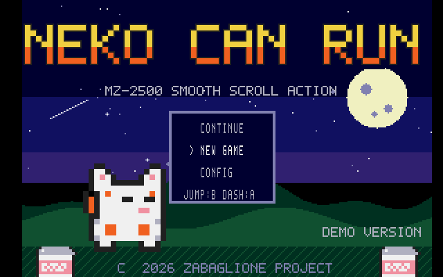

# MZ-2500 Web Emulator

SHARP MZ-2500 のブラウザエミュレータ。C++ コア → Emscripten/WASM + HTML/JS 構成
（コンセプト参照: [claude-famicom-emu](https://github.com/GOROman/cluade-famicom-emu)）。



**実機 ROM は一切使用・同梱していません。** IPL ROM のフロッピーブート動作は
ホスト側ネイティブコード（`core/dummy_ipl.cpp`）が代替する IPLPRO ブート実装で、
ROM フォントに依存しないソフトウェア（自前フォントを PCG に転送するタイトル）が
そのまま動きます。D88 イメージのドラッグ＆ドロップで起動できます。

動作検証タイトルとして、自作アクションゲーム **NEKO CAN RUN の無料デモ版
（WORLD 1）** を同梱しています。製品版（全4ワールド）は BOOTH にて頒布準備中。

## 実装範囲

MZ-2500 のうち、IPLPRO ブートのゲームソフトが使う範囲を実装:

- Z80B 6MHz（superzazu/z80、16bit I/O アドレスパッチ）
- バンクメモリ 64×8KB（B4h/B5h、IN(B5h) セレクタ自動+1 の癖を含む）
- MB8877 FDC 読み出し系 + D88（反転バス）、ネイティブ IPLPRO ブート
- テキスト画面 40/80桁 + PCG（モノクロ/3面合成カラー）、GDE 320×200 16色
  （リングスクロール SAD0-2/SLN1/HDSC、ウィンドウマスク）、CLUT、
  MZ-1M10 RGB444 パレット + デジタルパレット
- 8253 ch0 + 割込コントローラ（C6h/C7h、IM2）
- YM2203（ymfm。BUSY をサイクル精度でエミュレート）
- キーマトリクス、ジョイスティック（ゲームパッド対応）

漢字ROM・辞書ROM・RTC・SIO・CMT・FDC書込等は未実装（未使用ポートはログして
無視）。将来拡張の設計余地はモジュール構造で確保しています。

## ビルド

```bash
tools/build_native.sh     # macOSネイティブCLI（ヘッドレス検証用）
tools/build_wasm.sh       # WASM + web/dist（要 emscripten）
python3 -m http.server 8425 --directory web/dist
```

CLI はスクリーンショット（PPM）、メモリトレース、キー/ジョイパルス、WAV録音、
OPNレジスタトレース等を備えたヘッドレス回帰用フロントエンドです。

## 検証（クリーンルーム方針）

- 実装は標準チップのデータシート（MB8877 / i8253 / Z80 PIO / YM2203）と
  自作ゲーム開発で蓄積した機種ドキュメントに基づく新規実装。
  **EmuZ-2500（Common Source Code Project, GPL-2.0）はバイナリ実行による
  ブラックボックス検証オラクルとしてのみ使用**し、コード・データは一切
  取り込んでいません。
- FDC タイミングは EmuZ との黒箱比較で校正し、ブート・ロードの
  マイルストーンがフレーム単位で一致。
- タイトル画面・ロード画面は EmuZ 出力と **100.00% ピクセル一致**。
- BGM は EmuZ 録音との比較でエンベロープ相関 0.99+、スペクトログラム類似
  0.96-0.99、主要音高中央値比 1.0000。
- `tools/audit_dist.py` が配布物に実 ROM 由来バイト列が無いことを機械確認。

## 操作

SPACE = 決定/ジャンプ、カーソル = 移動、Z = ダッシュ。
ゲームパッド: A = ジャンプ, X = ダッシュ。

## ライセンス

- 本体: MIT（`LICENSE`）
- vendoring: superzazu/z80（MIT・改変あり）、ymfm（BSD-3-Clause）—
  `THIRD_PARTY_LICENSES.md` に全文
- 同梱の NEKO CAN RUN デモ版 D88: (C) 2026 ZABAGLIONE PROJECT。
  自由に再配布せず、本リポジトリ/公開ページからの利用にとどめてください

謝辞: EmuZ-2500 / Common Source Code Project（武田俊也氏）、
claude-famicom-emu（GOROman氏）。
